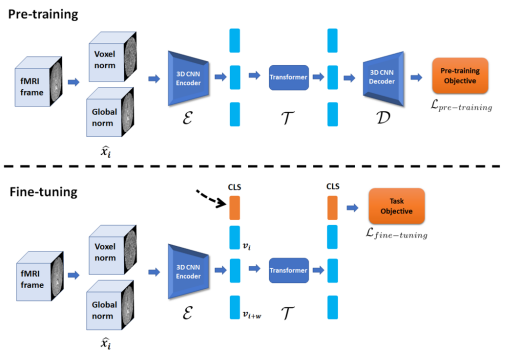

# Pre-training and Fine-tuning Transformers for fMRI Prediction Tasks


<p align="center">
    
</p>

## Contents
- [Datasets](#datasets)
- [Train with datasets](#training)
- [Pre-trained models](#additional-resources)
- [Cite](#citing--authors)


## Datasets
We currently support the following datasets
* BNU EOEC1 - Beijing Normal University's Eye Open & Eye Closed fMRI (part 1) dataset
  * Follow instructions at [BNU link](https://rfmri.org/DownloadRfMRIMaps) and download the dataset
  * Preprocess the data by configuring the folders and run 'data_preprocess_and_load/preprocessing.main()'


## Training
* For eye status prediction run 'python main.py --dataset_name BNU_EOEC1 --fine_tune_task binary_classification'
* For age prediction run 'python main.py --dataset_name BNU_EOEC1 --fine_tune_task regression'

## Tensorboard support
All metrics are being logged automatically and stored in
```
TFF/runs
```
Run `tensorboard --logdir=<path>` to see the the logs.

## Additional resources

Pre-trained models of phase 2 and 3 were too large to save them in the repo, so we decided to save them in drive storage. Feel free to download them and place them in <code>experiments</code> folder. Model name containing a word <code>transformer</code> should be saved in <code>BNU_EOEC1_...transformer_..._(numbers)</code> folder and other models follows the same convention.


## Citing & Authors

 TFF: Pre-training and Fine-tuning Transformers for fMRI Prediction Tasks
 ```
@misc{2112.05761,
Author = {Itzik Malkiel and Gony Rosenman and Lior Wolf and Talma Hendler},
Title = {Pre-training and Fine-tuning Transformers for fMRI Prediction Tasks},
Year = {2021},
Eprint = {arXiv:2112.05761},
}
 ```

Contact: [Gony Rosenman](mailto:gonyrosenman@mail.tau.ac.il), [Itzik Malkiel](mailto:itzik.malkiel@microsoft.com).
